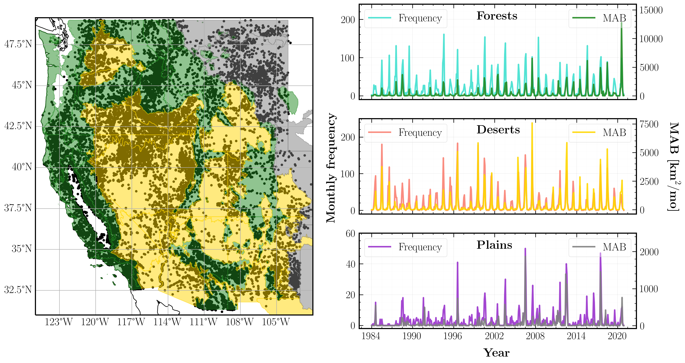

# SMLFire1.0: a stochastic machine learning (SML) model for wildfire activity in the western United States

A working repo for code, plots, and notes related to a ML based model of western US wildfires; these are visualized with Bailey's L3 ecoregions below:

We predict the fire frequency and sizes in each grid cell using a Mixture Density Network (MDN) trained on climate, vegetation, and human predictors. Here's a schematic diagram of our machine learning framework:

Code requirements:
* python=3.7.11
* tensorflow=2.7.0
* tensorflow-probability=0.15.0
* scipy=1.7.0
* numpy=1.20.0

Use the [package-list.txt](https://github.com/jtbuch/smlfire1.0/blob/master/package-list.txt) file to set up a compatible conda environment for execution.
