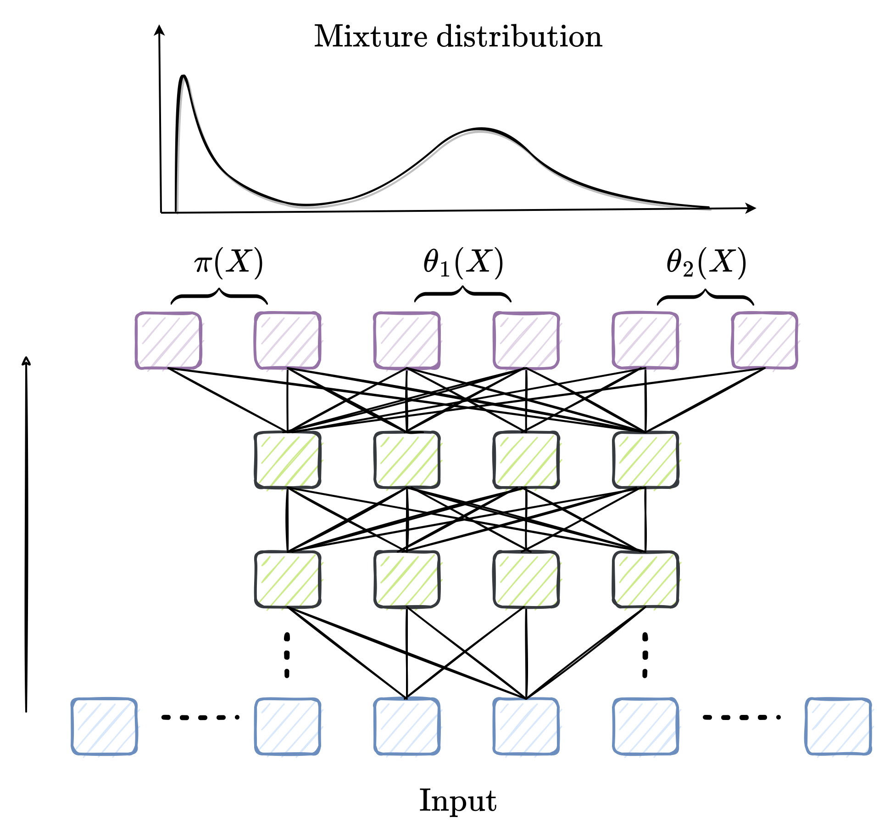

# SMLFire1.0: a stochastic machine learning (SML) model for wildfire activity in the western United States
A working repo for code, plots, and notes related to a ML based model of western US wildfires; these are visualized with Bailey's L3 ecoregions below:

We predict the fire frequency and sizes in each grid cell using a Mixture Density Network (MDN) trained on climate, vegetation, and human predictors. Here's a schematic diagram of our machine learning framework:

