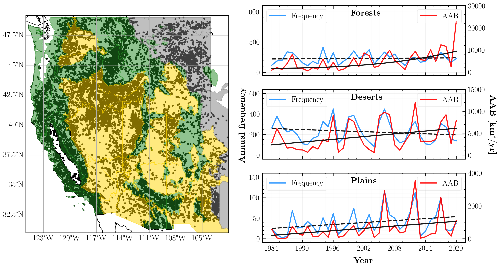
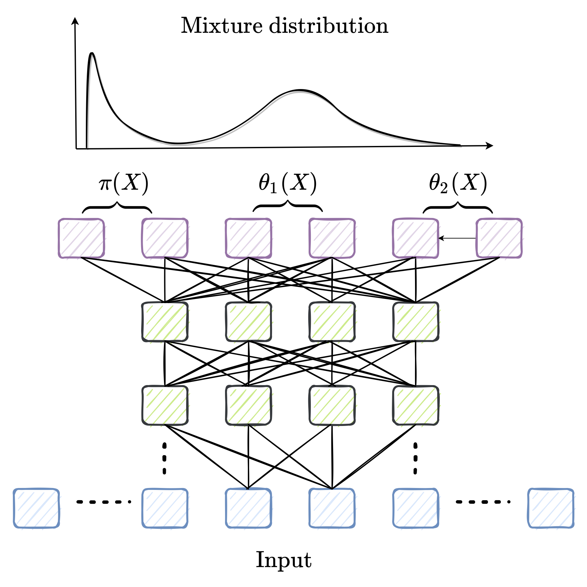

# SMLFire1.0: a stochastic machine learning (SML) model for wildfire activity in the western United States

A working repo for code, plots, and notes related to a SML based model of western US wildfires. The paper outlining the model and results is now available as a Geoscientific Model Development preprint: https://egusphere.copernicus.org/preprints/2022/egusphere-2022-1148/  

Our study region with all fires between 1984 and 2020 is visualized with EPA Level III ecoregions below:

We predict the fire frequency and sizes in each grid cell using a Mixture Density Network (MDN) trained on climate, vegetation, and human predictors. Here's a schematic diagram of our machine learning framework:

The scripts may be executed in the following order:
1. [ml_grid_plot_file.ipynb](https://github.com/jtbuch/smlfire1.0/blob/master/scripts/ml_grid_plot_file.ipynb) -- for reproducing all the plots in the preprint and Supplementary Information;
2. [ml_grid_fire_frequency_file.ipynb](https://github.com/jtbuch/smlfire1.0/blob/master/scripts/ml_grid_plot_file.ipynb) -- for training the fire frequency MDN, calculating the SHAP values, and performing model cross-validation;
3. [ml_grid_fire_size_file.ipynb](https://github.com/jtbuch/smlfire1.0/blob/master/scripts/ml_grid_plot_file.ipynb) -- same as above but for the fire size MDN;
4. [prelim_data_processing_and_analysis.ipynb](https://github.com/jtbuch/smlfire1.0/blob/master/scripts/prelim_data_processing_and_analysis.ipynb) -- for pre-processing the raw fire and climate data; the data is then organized into pandas dataframes for training machine learning models.

Code requirements:
* python=3.7.11
* tensorflow=2.7.0
* tensorflow-probability=0.15.0
* scipy=1.7.0
* numpy=1.20.0
* xarray (version agnostic)
* pandas (version agnostic)

Use the [package-list.txt](https://github.com/jtbuch/smlfire1.0/blob/master/package-list.txt) file to set up a compatible conda environment for execution.
